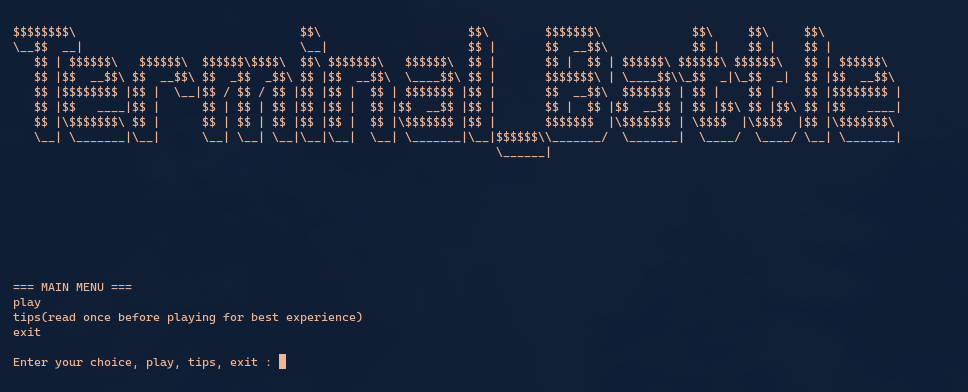
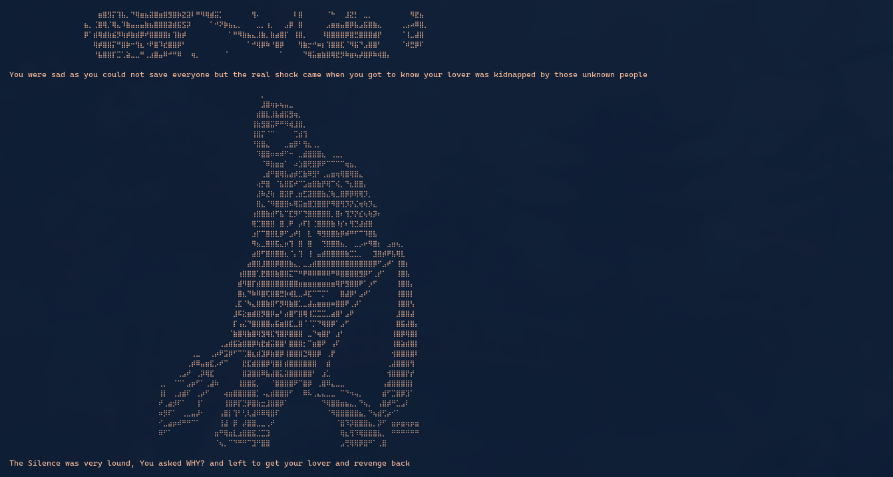
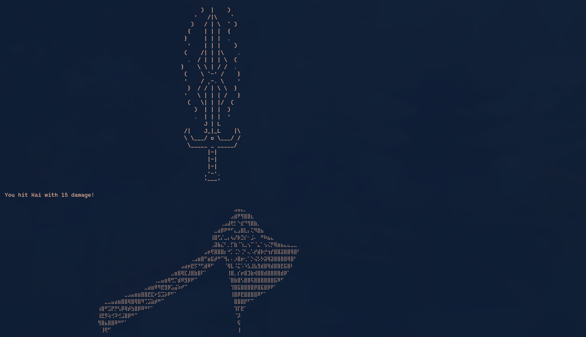

# Terminal Battle


# What Even Is This Project
This is a story-driven, text-based RPG that runs entirely in your Linux terminal. You play as a strong warrior living a peaceful life, until your village is attacked and your lover is kidnapped. You must fight your way through monsters to get revenge. But to make this game more interesting, I used dramatic ASCII art, background music, and a small story with different characters and bosses. Bosses have different attack damage, and the final boss is a very interesting one.

If you play this game, it might look like a normal game, but if you look at the code, you will see it's actually a small and simple game engine. You can add multiple bosses without copy-pasting your own code again and again, as there are functions I have made for that. So, you can easily add as many bosses as you want with their own custom ASCII art, sounds, and attacks.


# Built With

**Love**: Humans naturally have this but they keep forgetting its power as they grow up.

**Python**: The core programming language.

**Built-in Modules**: os, time, random, and sys for the engine logic and pacing.

**Linux / PulseAudio (paplay)**: For the synced audio and background music.


***Images***








**Game Demo Video:**

[)](https://youtu.be/m3jjpDLKQhg)


# How to Contribute

To contribute, all you have to do is simply play this game. I promise it's not that boring, plus it's short and available for free!

**Test and Report:** Find bugs, glitches, or things that can be improved.

**Suggest Ideas:** Share ideas for new features that you would like to see.

**English Corrections:** Since everything was typed by me manually, there might be some grammatical or spelling mistakes. If you spot any while playing, please let me know!


# Deployment

**How to Run Locally**

This game uses custom audio and terminal graphics, so it is designed specifically to run locally on **Linux**.

**Prerequisites:**

1. A Linux OS

2. Python 3

3. PulseAudio or PipeWire (for the paplay command to play sounds)

**Option 1**
**Play from the Release (Recommended)**

1. Go to the Releases tab on the right side of this GitHub page.

2. Download the latest .zip file.

3. Extract the folder, open your terminal inside that folder, and run:

```Bash
python battle.py
```


**Option 2**
**Clone the repository:**

```Bash
git clone https://github.com/Dixit106/Pythoning
```

2. Go into the folder(ignore learning loopholes folder):

```Bash
cd Pythoning
```

```Bash
cd terminal_battle
```

3. Start The Main Script

```Bash
python battle.py
```
